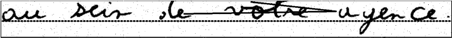
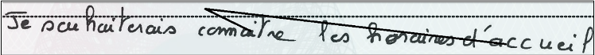

# 📙 HTR-VT (Pattern Recognition)
[](https://paperswithcode.com/sota/handwritten-text-recognition-on-lam-line?p=htr-vt-handwritten-text-recognition-with)

[](https://paperswithcode.com/sota/handwritten-text-recognition-on-read2016-line?p=htr-vt-handwritten-text-recognition-with)

[](https://paperswithcode.com/sota/handwritten-text-recognition-on-iam-line?p=htr-vt-handwritten-text-recognition-with)

# Handwritten Text Recognition with Noise Handling and Post-Processing

This repository is based on the HTR-VT model from the paper ["HTR-VT: Handwritten Text Recognition with Vision Transformer"](https://github.com/YutingLi0606/HTR-VT). We have extended the original implementation with:
1. Enhanced noise handling capabilities
2. Post-processing using Symspell for improved accuracy

## Key Enhancements

### 1. Noise-Robust Training
We retrained the model from scratch with augmented data that includes:
- Horizontal lines (simulating check fields)
- Various backgrounds
- Smudges
- Salt and pepper noise

A 50:50 ratio of clean and noisy images was used during training to ensure the model learns both clean character structure and noise handling.

### 2. Post-Processing with Symspell
We've integrated Symspell for fast and accurate spell-checking, specifically optimized for bank check processing:
- Custom dictionary for numeric words commonly found in check amounts
- Fast lookup based on Damerau-Levenshtein edit distance
- Compound spell checking for sentence-level text
- Processing time in order of milliseconds

#### Custom Dictionary Contents
The spell-checker includes commonly used terms in bank checks:
- Basic numbers: one, two, ..., ten
- Teens: eleven, twelve, ..., twenty
- Tens: thirty, forty, ..., ninety
- Magnitudes: hundred, thousand, lakhs, million

## Sample Images

### Training Data with Noise
Here are examples of our noisy training data that simulate real-world conditions:



*Sample 1: Handwritten text with horizontal lines and background noise*


*Sample 2: French text sample with dotted line background - demonstrates model's ability to handle different writing styles and line patterns*



*Sample 3: Another example of French text with dotted line patterns - showing consistency in handling structured backgrounds*

### Model Output
The model processes these noisy inputs and produces clean text output, which is then enhanced through Symspell post-processing. Output images can be found in the `output/predictions/` directory after running inference.

## Evaluation Results
The model achieves strong performance on test data even before post-processing:
- Character Error Rate (CER): 6.5%
- Word Error Rate (WER): 16.7%

These metrics are further improved after applying Symspell post-processing, particularly for numeric text in check amounts.

## Requirements

- Python 3.x
- PyTorch
- Symspell (for post-processing)
- Other dependencies listed in requirements.txt

## Setup

1. Create a virtual environment:
```bash
python -m venv venv
source venv/bin/activate  # On Unix/macOS
```

2. Install dependencies:
```bash
pip install -r requirements.txt
```

## Usage

### Testing the Model

To run inference on test images:

```bash
# For Apple Silicon Macs (M1/M2)
export PYTORCH_ENABLE_MPS_FALLBACK=1
python test.py --out-dir ./output --exp-name iam IAM --test-data-list ./Test_Data/ --show-images True
```

## Notes

- For Apple Silicon (M1/M2) Macs, the model uses MPS (Metal Performance Shaders) backend with CPU fallback for certain operations
- Prediction images are saved in the `output/predictions/` directory
- Post-processing with Symspell significantly improves Character Error Rate (CER) and Word Error Rate (WER)
- No pre-processing required for noisy images

## Dataset Information

The model is trained on a combination of:
1. IAM Dataset (English)
   - 13,350 line-level samples
   - 657 different writers
2. RIMES Dataset (French characters)
   - Additional line-level samples
   - Over 1,300 participants

### Data Augmentation
To make the model robust for real-world applications, we augment the training data with:
- Horizontal lines (simulating check fields)
- Various backgrounds
- Smudges
- Salt and pepper noise

The training uses a 50:50 ratio of clean and noisy images to ensure the model learns both clean character structure and noise handling.

## Acknowledgements

This work builds upon the [HTR-VT project](https://github.com/YutingLi0606/HTR-VT) by Yuting Li et al. We extend our gratitude to the original authors for their foundational work in handwritten text recognition using Vision Transformers.
